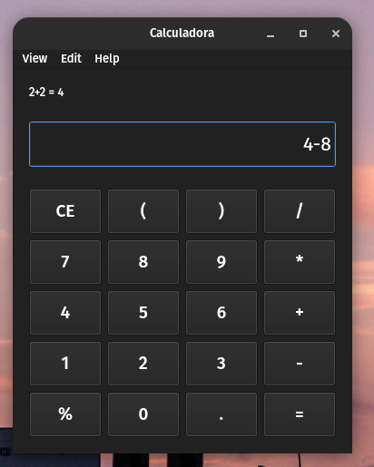

Calculadora em Python
========================
Um projeto de calculadora desenvolvido em Python utilizando a biblioteca PySide6 para criar uma interface gráfica intuitiva. A calculadora oferece funcionalidades básicas de cálculo, como adição, subtração, multiplicação e divisão. 

## Features
- Multi plataforma (Testada em Linux e Windows)
- Tratamento de Erros
- Adição, subtração, multiplicação e divisão de números.
- Suporte para expressões matemáticas complexas.
- Histórico de expressões e resultados anteriores.

## Instalação 

1. Clone o repositório para o seu sistema local:
```bash
git clone https://github.com/VicktorMS/PySide6Calculator.git
```

2. Navegue até o diretório do projeto:
```bash
cd PyCalc
```

3. Instale as dependências:
```bash
pip install -r requirements.txt
```

4. Execute o arquivo principal para iniciar a calculadora:
```bash
python main.py
```
## Capturas de Tela



## Licença
Este projeto está licenciado sob a [Licença MIT](LICENSE).